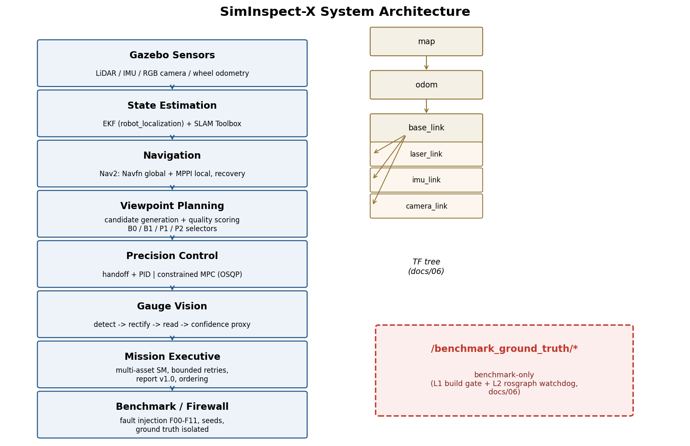

# SimInspect-X

## Perception-Aware Autonomous Industrial Inspection in a Simulation-First Plant Testbed

**One-sentence project claim**

> A ROS 2 autonomous mobile inspection robot that localises and navigates in a simulated industrial plant, chooses
> inspection viewpoints based on visibility and expected image quality, precisely approaches those viewpoints using
> classical or predictive control, reads industrial gauges from camera images, adapts when an inspection is uncertain,
> and quantifies robustness under repeatable faults.

This is intentionally **not** a tutorial-clone project. The mature ROS 2 ecosystem is reused for commodity robotics
infrastructure; the project's original engineering and research contribution is concentrated in:

1. **perception-aware inspection viewpoint selection**;
2. **adaptive re-inspection based on visual confidence**;
3. **precision approach control: PID vs MPC**;
4. **mission-level recovery and experiment methodology**.

## What this project is (five-minute version)

SimInspect-X is a closed, measurable chain: a simulated industrial plant with analog gauges, and a robot that must
navigate to each asset -> choose **where to stand** (candidate viewpoints scored by visibility, distance, incidence
angle, clearance and travel cost) -> align precisely (PID or constrained MPC) -> read the gauge -> judge its own
confidence -> re-inspect from another viewpoint when the reading is uncertain -> record the result -> return home
and export a structured report.

The flagship comparison is **fixed waypoint vs perception-aware viewpoint policy** (B0 vs P1/P2): does scoring
candidate viewpoints actually raise the proportion of valid readings, at what travel cost? The secondary comparison
is **PID vs MPC** for the final precision approach. Robustness is measured under twelve seeded fault scenarios
(F00-F11) with paired trials and ablations (A1-A6).

Honest status: the full stack is designed, implemented, unit-tested and packaged behind a one-command headless
demo; **runtime evaluation on the Ubuntu/Gazebo target is pending** (Windows development host has no ROS runtime).
The research report (`docs/report/REPORT.md`) therefore contains placeholder tables and no fabricated numbers.

## System architecture



Eight layers: Gazebo sensors -> EKF/SLAM state estimation -> Nav2 navigation -> viewpoint planning -> precision
control (PID/MPC) -> gauge vision -> mission execution -> benchmark/firewall. Ground-truth topics live under
`/benchmark_ground_truth/` and are firewalled from production autonomy (dual-layer CI enforcement).

Full details: `docs/report/REPORT.md` (research report) and `docs/03_SYSTEM_ARCHITECTURE.md`.

## Quick Start

One-command demo (headless, Docker):

```bash
./run_demo.sh
```

`run_demo.sh` builds the Docker image if needed and launches the 11 components of the inspection chain headlessly
(Gazebo plant world + robot, EKF, SLAM, Nav2, precision approach, candidate generator, P2 selector, gauge vision
node, asset registry, fault injector F00, mission executor), waits for a >=5-asset mission, then exports
`mission_report.json` plus a result summary to stdout.

- Prerequisites: Docker. Fixed seed (dev pool 21) and `config/demo_config.yaml` make runs reproducible.
- Expected output: `mission_report.json` (schema v1.0) with per-asset status/confidence/failure reason.
- Honest note: runtime validation requires the Ubuntu 24.04 container (ROS 2 Jazzy + Gazebo Harmonic); the
  Windows development host is static-verification only.

### Docker details

`run_demo.sh` builds `docker/Dockerfile` (Ubuntu 24.04 + ROS 2 Jazzy + Gazebo Harmonic) automatically; force a
rebuild with `./run_demo.sh --build`. For manual container use:

```bash
docker build -t siminspect-x -f docker/Dockerfile .
docker run -it --rm -v $(pwd):/home/siminspect/workspace siminspect-x
```

### Native Ubuntu 24.04

```bash
./setup.sh                 # rosdep + colcon build
source install/setup.bash
./run_demo.sh --in-docker  # or launch components directly (inside the container only)
```

### Headless operation

All simulation, tests and benchmarks run without GPU or display: Gazebo runs headless (`gz sim -s -r`), no X11
forwarding is required.

### Verify

```bash
colcon test && colcon test-result
```

## Why this version is stronger than a generic inspection robot

A generic system says:

```text
Waypoint -> Nav2 -> Camera -> Classification
```

SimInspect-X asks a harder and more inspection-specific question:

```text
Which viewpoint should I inspect from?
        |
Can I reach it safely?
        |
Can I align precisely enough?
        |
Is the target actually readable?
        |
If not, where should I move next?
```

That turns the project from `ROS integration` into a coherent robotics research system.

## Flagship research question

> Can a perception-aware inspection policy reduce failed/low-quality inspections compared with fixed predefined
> waypoints, while controlling extra travel time and maintaining mission reliability?

## Secondary control question

> For the final precision-approach stage, when does constrained MPC improve viewpoint alignment relative to a
> well-tuned classical PID-style controller?

## Core demonstration

The final demonstration should show:

1. the robot starts in a mapped industrial plant;
2. receives a mission containing 5-8 gauge assets;
3. schedules / visits them;
4. selects a valid candidate camera viewpoint for each gauge;
5. navigates to the local approach region with Nav2;
6. performs final alignment using the selected precision controller;
7. reads the gauge value and estimates confidence;
8. if confidence is insufficient, chooses a different viewpoint and re-inspects;
9. survives at least one blocked-route or degraded-visibility event;
10. returns home and exports a structured inspection report.

The recording blueprint for this demo is `docs/report/demo_video_script.md`.

## Directory structure

```text
src/siminspect_description/       robot model, Gazebo world, spawn launch
src/siminspect_localization/      EKF + SLAM/localisation
src/siminspect_navigation/        Nav2 (Navfn + MPPI), recovery
src/siminspect_viewpoint_planner/ candidate generation, quality scoring,
                                  B0/B1/P1/P2 selectors
src/siminspect_precision_control/ handoff manager, PID, constrained linear MPC
src/siminspect_gauge_vision/      detection, reading, confidence proxy, ROS node
src/siminspect_mission/           mission state machine, report schema, ordering
src/siminspect_benchmark/         fault injection, experiment runner, ablations,
                                  consolidated analysis
src/siminspect_interfaces/        ROS messages and actions
src/siminspect_assets/            asset YAML registry
src/siminspect_sim/               plant world files
docs/                             contract documents + research report
planning/                         master plan and phase specs
config/                           demo configuration
```

## Locked baseline stack

- Ubuntu 24.04 LTS
- ROS 2 Jazzy
- Gazebo Harmonic
- ros_gz
- ros2_control / gz_ros2_control
- robot_localization
- SLAM Toolbox
- Nav2 (Navfn global planner + MPPI local controller)
- siminspect_viewpoint_planner
- siminspect_precision_control
- siminspect_gauge_vision
- Python + C++ where appropriate

See:
- `docs/01_PROJECT_THESIS.md`
- `docs/02_ADMISSIONS_ALIGNMENT.md`
- `docs/04_ORIGINALITY_BOUNDARY.md`
- `docs/report/REPORT.md`
- `planning/MASTER_PLAN.md`
- `.agent/`

## Contributors

- Zihao Jiang ([PoorJeff](https://github.com/PoorJeff)) — author and maintainer.

## Licence

MIT (see package manifests under `src/`).