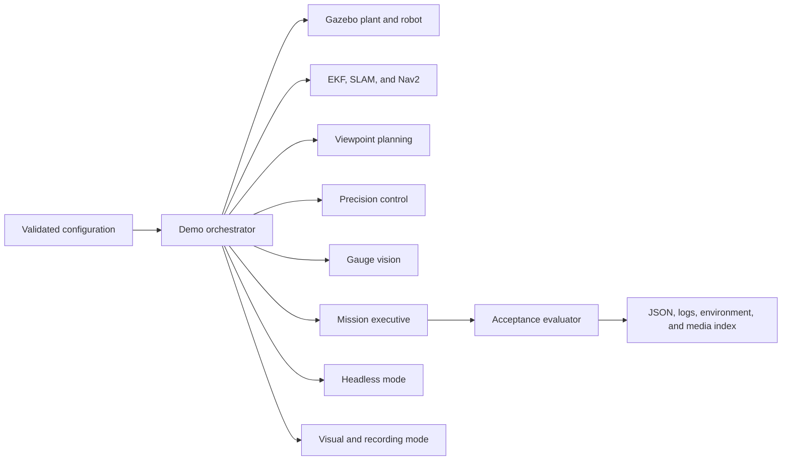

# SimInspect-X Product Completion Design

**Date:** 2026-08-13
**Status:** Approved design for implementation planning
**Delivery route:** Product-grade completion

## 1. Objective

Complete SimInspect-X as a credible, reproducible, and visually compelling
GitHub project. The release must demonstrate a real ROS 2/Gazebo inspection
mission, preserve machine-verifiable runtime evidence, publish representative
paired results, and present the project through an English primary README with
a synchronized Chinese README.

This work does not replace the existing project thesis. It closes the runtime,
demo, evidence, and public-presentation gaps around the Gold Core.

## 2. Current Truth

The repository contains the intended package structure, algorithms, launch
files, experiment framework, and unit tests. It is not yet ready to be described
publicly as runtime-validated because:

- the Ubuntu 24.04, ROS 2 Jazzy, and Gazebo Harmonic target has not completed an
  end-to-end acceptance run;
- the public CI workflow is not currently green;
- the demo has no real Gazebo/RViz recording or accepted mission artifact;
- `experiments/raw/` contains no release-quality paired trials;
- the OSQP MPC path lacks Ubuntu runtime evidence;
- some fault actuators and benchmark navigation goals are stubs or placeholders;
- public project status documents contain contradictory completion wording.

The implementation must correct these facts before changing the public status
to validated. No README polish, badge, result, or media asset may imply a gate
has passed before its evidence exists.

## 3. Product Narrative

The public repository will follow one reading path:

1. **See it:** a real Gazebo and RViz demo shows the robot inspecting gauges.
2. **Understand it:** the inspection loop and original engineering contribution
   are explained in plain language.
3. **Trust it:** architecture, ground-truth separation, CI, and acceptance gates
   show how the system is engineered.
4. **Verify it:** representative results link to raw trials, configurations,
   environment metadata, and the exact commit.
5. **Run it:** visual and headless entry points execute the same system.

The README must not read like a research report. It will be a product landing
page with an evidence trail. Existing report material remains in the repository
but is not part of the primary navigation.

## 4. Unified Demo Architecture

Visual and headless operation must share one orchestrator, component graph,
configuration, mission, and acceptance logic.



The supported public interface will be:

```bash
./run_demo.sh --headless
./run_demo.sh --visual
./run_demo.sh --visual --record
```

`--headless` is the CPU/CI path. `--visual` enables Gazebo and RViz without
changing autonomy. `--record` adds capture metadata and media outputs; it does
not bypass, replay, or replace the live mission.

## 5. Demo Storyboard

The formal demo uses one fixed development seed and one declared configuration.
It covers these seven stages:

1. load the plant and a six-asset mission;
2. navigate autonomously while showing the Gazebo motion and RViz path;
3. display candidate viewpoints and the selected score;
4. hand off to PID or MPC precision alignment and display pose error;
5. show the camera crop, estimated gauge value, and confidence proxy;
6. trigger a low-confidence alternative-viewpoint re-inspection;
7. return home and export the mission report and acceptance summary.

The 3-4 minute full video contains all stages. The 12-20 second README GIF uses
the most legible moments from navigation, selection, reading, re-inspection, and
report export. Both originate from the accepted run and share its run ID.

## 6. Runtime Evidence Model

Each run receives an immutable ID in the form:

```text
YYYYMMDDTHHMMSSZ_<short-commit>_<mode>_<seed>
```

The orchestrator writes the following layout:

```text
artifacts/runs/<run-id>/
  manifest.json
  environment.json
  config.yaml
  acceptance.json
  mission_report.json
  events.jsonl
  logs/
    orchestrator.log
    gazebo.log
    localization.log
    navigation.log
    viewpoint.log
    precision_control.log
    vision.log
    mission.log
  media/
    index.json
    screenshots/
    recording-metadata.json
```

`manifest.json` records the commit SHA, dirty-worktree flag, image identifier,
ROS distribution, Gazebo version, mode, world, mission, method, controller,
scenario, seed, start/end timestamps, and artifact checksums.

`acceptance.json` records each gate as `passed` or `failed`, its reason, and the
relative evidence paths. An overall run passes only when every required gate
passes. Failed runs and failed assets remain on disk.

Large runtime artifacts are ignored by Git. A curated release evidence bundle
contains the accepted manifest, report, acceptance summary, representative
logs, media index, and checksums. Complete video and large raw archives are
attached to a GitHub Release rather than committed to Git history.

## 7. Readiness, Failure Handling, and Cleanup

Fixed sleeps are not sufficient for acceptance. Every launched component must
have a bounded readiness probe:

- Gazebo world and simulation clock available;
- robot description and essential TF frames available;
- camera, LiDAR, IMU, and odometry topics publishing at a minimum rate;
- EKF output available;
- Nav2 lifecycle nodes active and action server ready;
- viewpoint, precision-control, vision, asset-registry, and mission interfaces
  discoverable;
- mission report written and schema-valid at completion.

When a readiness or mission timeout occurs, the orchestrator must:

1. identify the failing component and failed condition;
2. write the failure to `acceptance.json` and `events.jsonl`;
3. preserve all component logs and partial mission data;
4. terminate every process it started;
5. exit non-zero.

Signal handling for `SIGINT` and `SIGTERM` follows the same cleanup path. A
successful run also proves that no orchestrator-owned background process remains.

## 8. Acceptance Gates

### Gate A: Reproducible foundation

- clean clone on Ubuntu 24.04;
- Docker image builds from the repository root;
- dependency installation succeeds;
- `colcon build --symlink-install` succeeds;
- `colcon test --return-code-on-test-failure` succeeds;
- `colcon test-result --all --verbose` reports zero failures;
- ground-truth firewall checks pass;
- the exact public commit passes GitHub Actions.

### Gate B: Component smoke tests

- Gazebo plant loads headlessly;
- robot and all required sensors are present;
- localization and Nav2 reach ready state;
- viewpoint, control, vision, and mission nodes start and exchange their public
  interfaces;
- OSQP imports and the MPC solver produces non-fallback commands.

### Gate C: End-to-end mission

- the configured mission contains six assets and never fewer than five;
- the robot visits and records every asset or an explicit bounded failure;
- at least one valid gauge reading is produced through the camera pipeline;
- retries are bounded;
- the robot returns home;
- `mission_report.json` passes schema and semantic validation;
- the orchestrator exits zero and cleans up all owned processes.

### Gate D: Original contribution evidence

- B0 and P2 execute paired trials with identical scenario and seed assignments;
- low confidence causes a real alternative-viewpoint attempt;
- PID and OSQP MPC execute the same conditions and bounds;
- all failed trials remain in the raw dataset;
- summaries and plots are regenerated exclusively from raw trial files.

### Gate E: Public release

- English and Chinese READMEs contain equivalent commands, status, and claims;
- real demo media comes from an accepted exact-commit run;
- every public performance number links to raw-derived evidence;
- architecture, mission flow, and ground-truth firewall diagrams are current;
- root-level license, contribution, security, and troubleshooting material is
  present;
- the release evidence index lists the commit, environment, run IDs, raw data,
  plots, logs, and media checksums.

## 9. Representative Experiment Matrix

Development and debugging use only seeds 21-25. Final-pool seeds are not used
until behavior and parameters are frozen.

### Demo and end-to-end smoke

| Purpose | Method | Scenario | Seeds | Trials |
|---|---|---|---:|---:|
| Formal demo with re-inspection | P2 | F07 | 21 | 1 accepted recorded run |
| Nominal visual smoke | P2 | F00 | 21 | 1 accepted run |
| Representative recovery | P2 | F06 | 21 | 1 accepted recorded run |
| End-to-end smoke | P2 | F00, F06 | 21-23 | 6 |

F06 must be implemented as a real blocked fixed viewpoint actuator before it is
used. F07 must be verified to affect the camera-to-reader path rather than only
publish metadata. The formal F07 run must deterministically produce at least one
low-confidence reading, a different selected viewpoint, and a subsequent
inspection attempt while still satisfying the bounded mission rules. If F06 or
F07 cannot meet these requirements, implementation stops for a design amendment;
it does not silently substitute another condition or edit the footage around the
failure.

### Viewpoint policy comparison

| Methods | Scenarios | Final seeds | Paired trials |
|---|---|---:|---:|
| B0, P2 | F00, F06, F07 | 1-10 | 60 |

The B0 and P2 harnesses must send real navigation goals and drive the same
mission interface. Placeholder goals or pure in-process policy calls do not
satisfy this comparison.

### Precision-control comparison

| Methods | Conditions | Final seeds | Paired trials |
|---|---|---:|---:|
| PID, MPC | nominal, yaw error, measurement noise, wheel slip, saturation | 1-10 | 100 |

Both methods use identical targets, initial states, timestep, timeout, velocity
and acceleration bounds, and disturbance realizations. The MPC result is valid
only when OSQP solves the optimization path; fallback output is recorded as a
failed trial.

Candidate acceptance may use three paired development seeds while fixes are in
progress. Public numeric claims require all ten frozen final seeds.

The first final-pool run is a release-candidate data run used to prepare the
public results. After those derived results and links are committed, the exact
release-candidate commit is rerun through Gates A-D and the complete
representative matrix. The release proceeds only if its regenerated summaries
match the committed claims within deterministic serialization differences. Any
code, configuration, claim, or result correction creates a new candidate commit
and repeats this final verification loop.

## 10. Public Repository Structure

The product-facing additions and reorganized entry points are:

```text
README.md
README.zh-CN.md
LICENSE
CONTRIBUTING.md
SECURITY.md
.github/
  workflows/ci.yml
  ISSUE_TEMPLATE/
  pull_request_template.md
docs/
  architecture/
    system-overview.svg
    mission-data-flow.svg
    ground-truth-firewall.svg
  demo/
    README.md
    troubleshooting.md
    mission_report.example.json
  validation/
    ACCEPTANCE.md
    RESULTS.md
    evidence-index.json
  media/
    hero.webp
    demo-preview.gif
experiments/
  README.md
results/
  release/<version>/
    summary.json
    plots/
run_demo.sh
setup.sh
```

The README order is:

1. title, language switch, and badges whose state matches current CI;
2. one-sentence value proposition;
3. clickable real demo preview;
4. validated-capabilities table;
5. product inspection loop;
6. three to five traceable results;
7. architecture and mission-flow diagrams;
8. Docker quick start;
9. visual demo and headless acceptance modes;
10. reproducibility and evidence links;
11. limitations and explicit non-claims;
12. contribution, security, and license links.

Generated synthetic data is represented by a small licensed sample and its
generator. Large datasets and MP4 files are release assets, not regular Git
objects. Internal agent-state directories are excluded from the primary public
navigation and evaluated separately for archival after the runtime work is
complete.

## 11. Implementation Sequence

Implementation proceeds in this order and does not advance past a failed gate:

1. correct repository status and reproduce the current CI failure;
2. repair Docker, dependency, build, test, and firewall gates;
3. replace placeholder benchmark goals and the representative fault stubs;
4. implement the unified orchestrator, readiness probes, artifact model, and
   acceptance evaluator;
5. pass component smoke tests and validate OSQP MPC on Ubuntu;
6. pass headless end-to-end development runs;
7. pass visual mode and record the formal demo;
8. freeze parameters, run the representative candidate matrix, and generate
   candidate plots;
9. create public architecture/media/validation artifacts and both READMEs;
10. freeze the release-candidate commit, rerun Gates A-D and the representative
    matrix on that exact commit, verify the published claims, and publish the
    evidence-backed release.

Each implementation slice must be surgical, tested, and traceable to one of
these gates. Stretch features are not part of this sequence.

## 12. Explicit Non-Goals and Claim Boundaries

This release does not:

- claim real-hardware deployment;
- claim a real asset-synchronized digital twin;
- describe the confidence proxy as a calibrated probability;
- claim all F00-F11 scenarios are implemented or validated;
- require the full E1-E6 research matrix, B1/P1 publication, or all ablations;
- add an LLM mission parser, reinforcement learning, multi-robot coordination,
  a manipulator, or a photorealistic environment;
- publish a performance number that cannot be reproduced from preserved raw
  trials;
- remove failed trials to improve reported results.

## 13. Completion Definition

SimInspect-X is product-complete only when Gates A-E all pass on the same public
commit and the evidence index resolves every published claim to an accepted run
or raw-derived result. Until then, public status uses the wording
"implementation complete; runtime validation in progress" and identifies the
specific unpassed gates.
